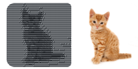

# unasciiclaw 🦀

[](https://www.npmjs.com/package/unasciiclaw)

Convert ASCII art to an image.

<p align="center">
  
</p>

`unascii` reads ASCII art text, maps each character's position in the ramp back to a brightness value, and writes a PNG, JPG, or WebP image. Each character becomes one pixel. Use `--scale` to upscale.

## What It Does

- converts ASCII art text to PNG, JPG, or WebP
- grayscale by default, full color with `--color` for ANSI-colored input
- three character ramps: classic, blocks, dense
- `--scale <n>` to upscale each character to NxN pixels
- automatic aspect ratio correction: terminal characters are 2x taller than wide, height is doubled by default
- reads from a file or stdin
- output defaults to `images/<input-name>.png`

## Requirements

- Node 22+

For development: pnpm

## Install

[unasciiclaw on npm](https://www.npmjs.com/package/unasciiclaw)

```bash
npm install -g unasciiclaw
```

Or clone and build from source:

```bash
git clone https://github.com/psandis/unasciiclaw.git
cd unasciiclaw
pnpm install
pnpm build
```

## Quick Start

```bash
unascii ascii/cat1.txt                  # grayscale PNG to images/cat1.png
unascii ascii/cat1.txt --scale 8        # upscaled 8x, 800x640 pixels
unascii ascii/cat1.txt -o result.jpg    # JPG output
unascii ascii/cat1-color.txt --color    # full color from ANSI input
```

## Demo

Input ASCII art (`ascii/cat1.txt`):

```
@@@@@@@@@@@@@@@@@@@@@@@@@@@@@@@@@@@@@@@@@@@@@@@@@@@@@@@@@@@@@@@@@@@@@@@@@@@@@@@@@@@@@@@@@@@@@@@@@@@@
@@@@@@@@@@@@@@@@@@@@@@@@@@@%%@@@@@@@@@@@@@@@@@@@@@@@@@@@@@@@@@@@@@@@@@@@@@@@@@@@@@@@@@@@@@@@@@@@@@@@
@@@@@@@@@@@@@@@@@@@@@@@@@%%@@@%@@@@@@@@@@@@@@@@@@@@@@@@@@@@@@@@@@@@@@@@@@@@@@@@@@@@@@@@@@@@@@@@@@@@@
```

Output: `images/cat1.png` - a grayscale PNG where each character is one pixel. Use `--scale 8` for a visible result at 800x640.

## CLI Options

```
unascii [input] [options]
```

Run `unascii --help` at any time to see the full option list in your terminal.

| Option | Short | Default | Description |
|--------|-------|---------|-------------|
| `--output <file>` | `-o` | `images/<name>.png` | Output image path. Format is inferred from the extension: `.png`, `.jpg`, `.webp`. |
| `--ramp <name>` | `-r` | `classic` | Character ramp: `classic`, `blocks`, or `dense`. Must match the ramp that was used to produce the ASCII art, otherwise brightness values will be wrong. |
| `--invert` | `-i` | off | Invert brightness mapping. Dark characters become bright pixels and vice versa. Use if the ASCII art was produced with `--invert`. |
| `--color` | `-c` | off | Input contains ANSI 24-bit color codes. Each character's RGB values are extracted from the escape sequence and written as a color pixel instead of a grayscale value. |
| `--scale <number>` | `-s` | `1` | Upscale each character to NxN pixels. `--scale 8` turns a 100-char wide input into an 800px wide image. |
| `--no-fix-aspect` | | off | Disable automatic 2x height stretch. By default height is doubled to correct for terminal character aspect ratio: characters are approximately twice as tall as wide, so a square image rendered as ASCII art appears squashed without this correction. |
| `--version` | `-V` | | Print the version number and exit. |
| `--help` | `-h` | | Show all available options and exit. |

## Output Formats

| Format | Extension | Notes |
|--------|-----------|-------|
| PNG | `.png` | Lossless. Default. Best for pixel-accurate output, no quality loss. |
| JPG | `.jpg`, `.jpeg` | Lossy. Smaller file size, introduces compression artifacts. |
| WebP | `.webp` | Lossy or lossless depending on settings. Smaller than PNG, better quality than JPG at the same size. |

For ASCII art with sharp pixel edges, PNG is recommended. JPG and WebP are fine for sharing or display where file size matters.

## Color Mode

When the input contains ANSI 24-bit color escape codes (`\x1b[38;2;R;G;Bm`), pass `--color` to extract the original RGB value from each character and write a full color image.

Without `--color`, input is treated as plain text and the output is grayscale.

## Ramps

| Ramp | Characters | Best for |
|------|-----------|----------|
| `classic` | `@%#*+=-:. ` | general use, photos |
| `blocks` | `█▓▒░ ` | bold, high contrast |
| `dense` | full printable ASCII set | maximum brightness levels |

Dark characters (`@`, `%`, `#`) map to low pixel values. Light characters (`.`, space) map to high pixel values. The ramp must match what was used to produce the ASCII art.

## Scaling

Each character in the input becomes exactly one pixel. Without `--scale` a 100-char wide input produces a 100px wide image.

| Command | Input width | Output width |
|---------|------------|--------------|
| `unascii art.txt` | 100 chars | 100px |
| `unascii art.txt --scale 4` | 100 chars | 400px |
| `unascii art.txt --scale 8` | 100 chars | 800px |

## Limitations

The conversion is lossy. ASCII art typically has 10-90 brightness levels depending on the ramp, no sub-character detail, and reduced resolution. The output is a low-resolution, quantized representation, not a restoration.

## File Structure

```
unasciiclaw/
├── src/
│   ├── index.ts              # CLI entry point
│   ├── convert.ts            # ASCII-to-image core
│   └── ramps.ts              # character ramp definitions
├── tests/
│   ├── images/               # test fixtures
│   └── convert.test.ts
├── ascii/
│   ├── cat1.txt              # sample grayscale ASCII art
│   └── cat1-color.txt        # sample ANSI color ASCII art
├── images/
│   ├── cat1.png
│   ├── cat1-color.png
│   ├── cat1-large.png
│   └── cat1-color-large.png
├── assets/
├── .gitignore
├── LICENSE
├── README.md
├── biome.json
├── package.json
├── pnpm-lock.yaml
├── tsup.config.ts
└── tsconfig.json
```

## Development

```bash
git clone https://github.com/psandis/unasciiclaw.git
cd unasciiclaw
pnpm install
pnpm build
pnpm test
pnpm lint
unascii --help
```

## Testing

```bash
pnpm test
```

8 tests covering output dimensions, pixel brightness values, invert mode, scale, aspect fix, color ANSI parsing, format detection, and empty input handling.

## Related

- 🦀 [Asciiclaw](https://github.com/psandis/asciiclaw): Convert images to ASCII art
- 🦀 [Feedclaw](https://github.com/psandis/feedclaw): RSS/Atom feed reader and AI digest builder
- 🦀 [Dustclaw](https://github.com/psandis/dustclaw): Find out what is eating your disk space
- 🦀 [Driftclaw](https://github.com/psandis/driftclaw): Deployment drift detection across environments
- 🦀 [Dietclaw](https://github.com/psandis/dietclaw): Codebase health monitor
- 🦀 [Wirewatch](https://github.com/psandis/wirewatch): Network traffic monitor with AI anomaly detection

## License

See [MIT](LICENSE)
